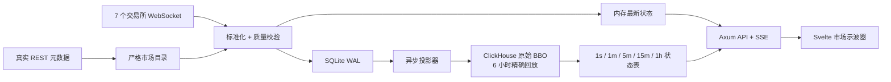

# Exchange Spread v2

一个从真实交易所元数据出发、只处理最佳买卖价（BBO）的跨交易所价差观测器。它是完全独立的新项目，不读取旧配置、不复用旧数据库表，也不提供历史接口兼容层。

## 为什么重做

旧项目把市场发现、WebSocket 采集、标准化、存储、查询兼容和页面状态堆叠在同一条演进路径上：

- 单条事件通道后接同步存储，数据库抖动会向上游传播；
- 前端直接承担查询拼接、旧数据兼容和展示逻辑，页面体积与状态复杂度持续增长；
- Python 配置生成器、Rust 采集器、ClickHouse 查询和前端各自理解一份市场语义；
- 报价币种转换与旧字段回退会掩盖数据是否真的可比；
- 页面一次拉取和处理过多原始数据，长时间区间难以快速打开。

v2 只保留已经由测试覆盖的交易所消息解析和订单簿算法，其余边界重新设计。

## 新架构



关键约束：

- 市场目录优先从真实 API 发现，成功结果原子写入本地缓存；单个目录暂时不可用时保留该交易所的 last-known-good 计划；
- 运行中按固定周期刷新目录，只重启订阅计划发生变化的交易所；可显式禁用故障交易所；
- 市场集合以 Lighter 为锚，只有同时出现在 Lighter 和至少一个其他交易所的 `base_asset` 才会订阅；
- USD、USDC、USDT、AUSD 的 1:1 关系作为显式报价规则参与计算，不把换算隐藏在 symbol 归一化里；
- 事件先落本地 SQLite WAL，再更新内存视图，ClickHouse 故障不会丢失已经接收的数据；
- 缺档、过期、交叉盘或不一致的数据不会进入可交易价差；
- 实时展示走内存与 SSE，历史展示按时间跨度自动选预聚合表；
- 原始事件保留 6 小时；1 秒到 1 小时的分层状态分别保留 1、1、4、11、35 天。

## 大流量写入策略

实时订阅全部可比较市场时，BBO 变化可能达到每秒数百至数千条。v2 对三个目标分别处理：

- 页面实时性：每条合格事件立即更新内存，SSE 不等待远程数据库；
- 故障安全：标准化事件按接收顺序批量提交到 SQLite WAL，ClickHouse 不可用时保留积压；
- 运行时隔离：SQLite 的批量写入、projector 读取和 checkpoint 提交都在 blocking 线程池执行，不占用 WebSocket 的异步调度线程；
- 行情背压隔离：所有交易所都按 instrument 合并尚未落盘的中间 BBO，只保留最新状态，WebSocket 读取与协议心跳不会被存储队列阻塞；
- Perpl 协议：与官方网页客户端一致，订阅 `heartbeat@<chain_id>` 并校验服务端序列；不再发送会计入请求额度的应用层心跳；
- 写入吞吐：投影器连续读取最多 5,000 条事件，使用 `JSONEachRow` 大批写入，成功后才推进 checkpoint。

ClickHouse 不长期复制每一条高频原始事件。原始流仅用于近期排错和精确回放，长历史由物化视图生成的分层状态表承担。这样最长仍能查询 31 天，同时避免按当前市场规模累积十亿级原始行。

当前接入：

- Hyperliquid
- Lighter
- RiseX
- 01
- Perpl
- Ondo

Ethereal 源码仅作为归档保留，模块入口、目录发现和适配器工厂均已注释，不参与编译或运行。

## 订阅队列如何生成

交易对不是手工配置，也不是从历史数据库推断。collector 启动及运行中定期并发请求各交易所的公开市场目录：

| 交易所 | 市场目录 | 进入候选目录的条件 | WebSocket 订阅键 |
|---|---|---|---|
| Hyperliquid | `POST https://api.hyperliquid.xyz/info`，`type=allPerpMetas` + `spotMeta` | `isDelisted != true`，且 `collateralToken` 能映射到已配置换算的 quote | `universe[].name` |
| Lighter | `GET https://mainnet.zklighter.elliot.ai/api/v1/orderBooks` | `market_type=perp` 且 `status=active` | `market_id` |
| RiseX | `GET https://api.rise.trade/v1/markets` | `active != false` 且 `config.unlocked != false` | `market_id` |
| 01 | `GET https://zo-mainnet.n1.xyz/info` | 能解析出 `marketId` 和以 `USD` 结尾的 `symbol` | `symbol` |
| Perpl | `GET https://app.perpl.xyz/api/v1/pub/context` | `config.is_open=true` | `id` |
| Ondo | `GET https://api.ondoperps.xyz/v1/markets` | `disabled != true` | `market` |

候选目录随后按照原版已经验证过的 Lighter 锚定规则生成真正的监控队列：

1. 每个原始市场先标准化为 `venue + instrument_id + base_asset + quote_asset`；
2. Hyperliquid 使用 `allPerpMetas.collateralToken` 与 `spotMeta.tokens` 确定每个 perp DEX 的真实 quote；因此默认永续和 HIP-3 市场都会参与匹配，但 USDH、USDE、USDT0 等没有显式换算规则的市场会被排除；
3. Lighter 的 active perp 按 base 去重后作为锚点，与其他五个交易所的 base 并集取交集；
4. 每个交易所只保留交集中的真实 instrument；同一交易所、相同 base 的重复合约只选一个；
5. `/v1/markets` 也按 base 分组，所以 `BTC/USD`、`BTC/USDC`、`BTC/AUSD` 会出现在同一个 BTC 市场中；
6. 价差计算前使用显式报价规则把两腿价格换算到共同 quote；当前规则与原版一致：`USDC→USD=1`、`USDT→USD=1`、`AUSD→USD=1`。

这种设计保证每个订阅市场都有 Lighter 作为共同基准，同时仍保留每家交易所真实的 instrument id、feed symbol 和 quote asset。若未来不再接受固定 1:1 报价规则，应把稳定币现货/预言机价格作为新的数据源接入，而不是修改 symbol。

## 启动

要求 Rust 1.94+、Node.js 20+；容器构建已固定为 Rust 1.94 和 Node.js 22。

```bash
cp .env.example .env
# 填写 ClickHouse 连接信息
cd web
npm ci
npm run build
cd ..
cargo run --release
```

打开 `http://localhost:8080`。服务启动后，后台投影器会重试 ClickHouse 连接并执行幂等 migration；远端短暂不可用不会阻塞 WebSocket、WAL 和实时 API 启动。

也可以把采集/API 与前端作为两个独立容器部署，不需要 Docker Compose。

```bash
docker build -f Dockerfile.collector -t exchange-spread-collector .
docker build -f Dockerfile.frontend -t exchange-spread-frontend .
```

Collector 需要 ClickHouse 环境变量和持久化的 `/app/data`：

```bash
docker run -d \
  --name spread-collector \
  --env-file .env \
  -v spread-wal:/app/data \
  -p 8081:8080 \
  exchange-spread-collector
```

前端只需要知道 collector 的 HTTP 地址。`COLLECTOR_UPSTREAM` 在容器启动时写入 Nginx 配置，不会重新构建前端；地址末尾不要带 `/`：

```bash
docker run -d \
  --name spread-frontend \
  -e COLLECTOR_UPSTREAM=http://your-collector-service:8080 \
  -p 8080:8080 \
  exchange-spread-frontend
```

在 Zeabur 中分别创建两个服务并选择对应 Dockerfile。Collector 暴露 `8080`、挂载 `/app/data` 并配置 `.env.example` 中的变量；Frontend 暴露 `8080`，将 `COLLECTOR_UPSTREAM` 设置成 Collector 的内部 HTTP 地址。Nginx 会代理 `/v1/*`、`/metrics` 和长连接 SSE，浏览器无需跨域访问。

## API

| 路径 | 用途 |
|---|---|
| `GET /v1/markets` | 当前可比较市场、交易所腿和数据新鲜度 |
| `GET /v1/live/spread?leg_a=...&leg_b=...` | 当前价差与持续 SSE 更新 |
| `GET /v1/spreads?leg_a=...&leg_b=...&range_ms=...` | 由服务端时钟锚定、最长 31 天的对齐历史价差 |
| `GET /v1/health` | ClickHouse、WAL 与采集计数 |
| `GET /metrics` | Prometheus 文本指标 |

历史查询分辨率：

| 查询跨度 | 使用状态表 |
|---|---|
| ≤ 15 分钟 | 1 秒 |
| ≤ 12 小时 | 1 分钟 |
| ≤ 3 天 | 5 分钟 |
| ≤ 10 天 | 15 分钟 |
| ≤ 31 天 | 1 小时 |

## 数据模型

- `instrument_catalog`：真实 API 返回的市场身份与规则；
- `bbo_events`：不可变的标准化 BBO 事件，保留 6 小时；
- `venue_state_events`：重连/失联边界；
- `bbo_state_*`：用于页面快速查询的多分辨率最新状态，最长保留 35 天；
- `data/wal.sqlite3`：尚未确认写入 ClickHouse 的本地事件。

数据库凭据只放在未跟踪的 `.env` 中。`.env.example` 只保留占位符。

目录与运行控制：

- `CATALOG_CACHE_PATH`：last-known-good 订阅计划，默认 `data/catalog.json`；
- `CATALOG_REFRESH_SECONDS`：在线目录刷新周期，默认 `3600`；
- `DISABLED_VENUES`：逗号分隔的 venue id，例如 `01,ondo`。Lighter 是目录锚点，禁用后服务会拒绝生成不可比较的订阅计划。

## 验证

```bash
cargo fmt --all -- --check
cargo test
cargo clippy --all-targets -- -D warnings
cd web
npm run check
npm run build
npm audit --omit=dev
```
